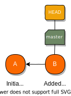
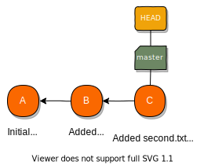
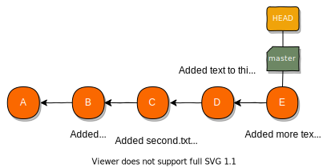
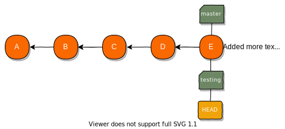
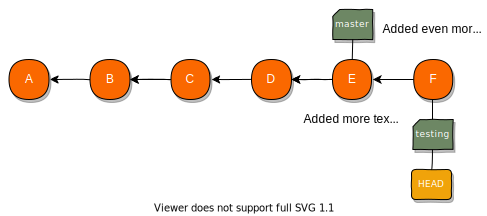
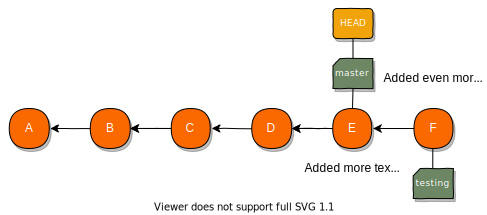
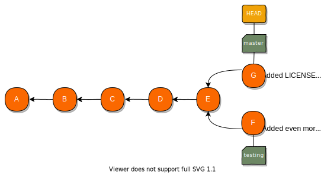
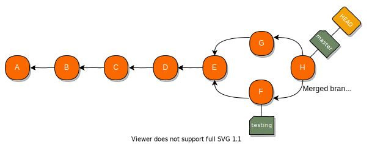
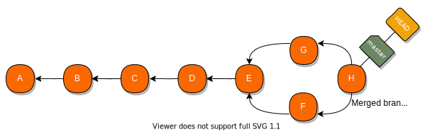

# [Software Design and Testing Laboratory](https://sigarra.up.pt/feup/en/UCURR_GERAL.FICHA_UC_VIEW?pv_ocorrencia_id=560099)


## Lab-01: A Brief Introduction to Java and Git


### 1. First Java Project


> :interrobang: **IMPORTANT**: We wil be using [IntelliJ IDEA](https://www.jetbrains.com/idea/) in class. There are two versions: Ultimate and CE. The ultimate edition requires a license, whereas CE is free. 


Let's start by creating a project in [IntelliJ IDEA](https://www.jetbrains.com/idea/):

- Open IntelliJ and choose the "New Project" option.
- Choose "Java" for the type of project and a suitable project SDK (>= 11.0.0). Click "Next".
- Do not choose any of the available project templates. Click "Next".
- Name the project `helloworld` and choose a suitable project location. Click "Finish".

The steps above will create a `.idea` directory and a `helloworld.iml` file. These are where IntelliJ keeps all the settings for your project. Note that there is also a `src` directory where all the source code is stored.

On the Project tool window (the frame on the left), open the `helloworld` folder, right-click the `src` directory, and choose "New > Java Class". Name your class `Application`, and include a `main` method, so that the code will look like the sample below.

```java
public class Application {
   public static void main(String args[]) {
       System.out.println("Hello World");
   }
}
```

> :woman_technologist: **Tip**: an easier way to create the main method is to just write `psvm` (short for public static void main) and select the first auto-complete suggestion. Try it.
> 
> You can also write `sout` as a shortcut for `System.out.println()`.

Right-click the `Application` class on the Project tool window and choose "Run 'Application.main()'". This will compile and run your application. You should see `Hello World` displayed on the console.

Congratulations, you have created your first Java application!

> :woman_technologist: **Tip**: To run your code, you can also click one of the green play buttons (⯈) that appear in the gutter right by the `Application` class or `main` method.
>
> After running the application for the first time you can also use the run button (⯈) on the top bar.
>
> Or just press `Shift+F10`...

Take a moment to check the `out` directory. This is where IntelliJ generates the result of the compilation process. You should be able to find there an `Application.class` file. This file contains the bytecode, generated from the source code, that can be run using any Java Virtual Machine (JVM).

### 2. Initialize Git Repository

[Git](https://git-scm.com/) is the version control system that we will use to manage the different versions of our files. It can be used locally (on our machine only) or with a server (to share code and collaborate with other team members). We will start by using it locally.


> :woman_technologist: **Tip**: For now, the command line will be used for all our interactions with Git. The use of a \*nix OS (e.g.: MacOS, GNU/Linux) is advised, but otherwise you may find the command line as Git Bash on Windows and Terminal on MacOS.

Start by changing directory to the root directory of our newly created IntelliJ project and initialize a new Git repository.

```shell
cd directory/of/my/project/helloworld # change to the directory
git init                              # initialize the git repository
```

This will create a `.git` directory, where the version history of our project will be locally kept. You can check the current directory contents by doing:

```shell
ls -la       # list directory content
```

Now let's see the status of your files by running the command below. Try it with and without the `-s` flag, which gives us a more concise output.

```shell
git status
git status -s
```

As you can see by the output, all files are reported as untracked by Git. You will create the first Git version of the project using some of these files, but it would be best to simply ignore some of the others:

- We will ignore the `out` directory because it can be regenerated from the source code.
- We will ignore the `.idea` directory and `*.iml` files as they are IntelliJ specific and other developers might use different IDEs.

To do this, execute the command below. Note that, after this, git status no longer reports the ignored files as untracked.

```shell
echo "out/" >> .gitignore     # this appends out to the .gitignore file
echo ".idea/" >> .gitignore   # this appends .idea to the .gitignore file
echo "*.iml" >> .gitignore    # this appends *.iml* to the .gitignore file
git status
```

> You could also just create and edit the `.gitignore` file using a text/code editor. We are just being fancy...

Now, it is time to create the first version of our project. Let's start by adding the files to the staging area and then committing them using the commands below. Execute the git status command before and after each one of these steps to see how the files change state.

```shell
git status
git add .gitignore src             # add files to the staging area
git status
git commit -m "Initial commit"     # commit the new version
git status
```

<p align="center">
  
</p>

> If you commit without using the `-m "<message>"` flag, Git will open your configured text/code editor so that you can input your commit message. You need to save/close the editor for the commit to continue. If you are in the terminal and can't figure out how to save or close the text editor, you're probably using [VIM](https://opensource.com/article/19/3/getting-started-vim). You can change the default text editor if you want to.

### 3. Making another commit

Now that we know how to add files to the staging area and committing them, follow the steps below:

- Create a file called `first.txt` with some text. If you do this in IntelliJ, it will ask if you want to add it to Git. Say **no (cancel)**! We will do it manually for now.
- Add `first.txt` to the staging area (using `git add`).
- Commit with the message "Added first.txt" (using `git commit -m "message"`).
- Confirm that all changes are committed (using `git status`).

<p align="center">
  
</p>

### 4. Inspecting the log

To see the list of commits that we have so far (only two at this point) execute the command below (press `q` to exit).

```shell
git log
```

You can also provide the `--oneline` flag to the `git log` command to get a cleaner list of commits and the `-<number>` flag to limit the number of entries to be shown.

```shell
git log --oneline -1
```

The `-p` flag shows the difference (the patch output) introduced in each commit.

```shell
git log -1 -p
```

### 5. Adding and Removing

A single commit may change multiple files in different ways:

- Create a file called `second.txt` with some text.
- Delete the `first.txt` file (you can use `rm first.txt` in the command line).
- Add `first.txt` and `second.txt` to the staging area (using `git add`).
- Confirm that all changes are staged (using `git status`).
- Commit with the message "Added second.txt and removed first.txt" (using `git commit -m "message"`).
- Confirm that all changes are committed (using `git status`).
- Check out your current commits (using `git log`).

<p align="center">
  
</p>

> :woman_technologist: **Tip**: Deleting `first.txt` and adding that change to the staging area could have been done with a single command: `git rm first.txt`.


### 6. Partially staged files and diff

- Add some text to a new file called `third.txt` file.
- Confirm the existing changes (using `git status`).
- Add these changes to the staging area (using `git add`).
- Add some more text to the `third.txt` file.
- Confirm the existing changes using git status and also `git status -s`. Note how the `third.txt` file is reported: at the same time, staged (for some of the changes) and not staged (for the rest of the changes).
- Commit with the message "Added text to third.txt" (using `git commit -m "message"`).
- Confirm that there are still unstaged changes (using `git status`).
- Use `git diff third.txt` to check what these changes are.
- Add the remaining changes to the staging area (using `git add`).
- Commit with the message "Added more text to third.txt" (using `git commit -m "message"`).
- Confirm that there are no more changes (using `git status`).
- Check out your commits (using `git log` or `git log --oneline`).

<p align="center">
  
</p>

### 7. Branching and merging

A branch in Git is a pointer to a particular commit. As we start committing, we are given a default `master` branch. Every time we create a new commit, the current branch pointer moves forward automatically.

```shell
git log --oneline      # shows commits pointed by existing branches
git branch             # shows branch that we're currently working on
```

> GitHub now calls this branch main, because [reasons](https://github.blog/changelog/2020-10-01-the-default-branch-for-newly-created-repositories-is-now-main/#:~:text=The%20default%20branch%20name%20for,%2Fsettings%2Frepository%2Ddefaults%20page)...

When executing the commands above we may also note a reference to `HEAD`. This is a special pointer used by Git that defines which is the current branch. The asterisk in the output of the second command also represents the `HEAD`.

Let's now create a new branch with the name `testing` and switch to it.

```shell
git branch testing    # create the new branch
git branch            # check that we're still on the master branch
git checkout testing  # switch to the testing branch
git branch            # check that we're really on the testing branch now
```

<p align="center">
  
</p>

> :woman_technologist: **Tip**: The commands `git branch testing` and `git checkout testing` could be done in a single step with the equivalent command: `git checkout -b testing`.

Now, let's make a few changes to the `third.txt` file and add a new commit to the `testing` branch:

- Add some more text to the `third.txt` file.
- Add the changes to the staging area (using `git add`).
- Commit with the message "Added even more text to third.txt" (using `git commit -m "message"`).

Let's look at the effect that this has on our commit log. Run the command below:

```shell
git log --oneline
```

<p align="center">
  
</p>

Notice that the `testing` branch points to the latest commit, but the `master` branch is still pointing to the previous one, where the branch was created. When you add a new commit, the current branch - the one the `HEAD` points to - updates so it points to the new commit.

Let's switch back to the `master` branch and see the difference. Run the commands below, and note how there is no trace of the commit that we made in the `testing` branch.

```shell
git checkout master                # switch back to the master branch
git log --oneline
```

<p align="center">
  
</p>

Now that we are back in our `master` branch, let's do some more changes:

- Create a new file called `LICENSE` with the following text: "This is the license text for our application".
- Add the changes to the staging area (using `git add`).
- Commit with the message "Added LICENSE file" (using `git commit -m "message"`).

<p align="center">
  
</p>

At this point we have two divergent histories that can keep evolving independently but that will eventually be merged back together. We will now merge the testing branch back into the master.

> :heavy_exclamation_mark: **Note**: This is done from the `master` branch, which will receive all the changes from the testing branch.

Git uses two main strategies to merge branches:

- Fast-forward merge (when there is no divergent work).
- Three-way merge (when there is divergent work).

In this example, there was divergent work, so a three-way merge is needed. This implies that a new commit with the merged files will be created. Execute the following command to merge the two branches and Git will ask you to enter a message for the new commit.

```shell
git merge testing
```

> :heavy_exclamation_mark: **Note**: As always, the current branch is the one following the new commit.

<p align="center">
  
</p>

As we do not need the `testing` branch any longer, we can delete it. This will leave all commits intact, it will only delete the pointer.

```shell
git branch -d testing     # this cannot be done from inside the testing branch
```

<p align="center">
  
</p>

### 8. Handling Merge Conflicts

Not all merges work as cleanly as in the previous example. If you change the same part of the same file in the two different branches, Git won't be able to merge them cleanly. Let's try to create this scenario.

Start by creating (but not switching to) a `testing` branch again.

```shell
git branch testing
```

Now let’s change our `Application.java` file so that it contains the following code:

```java
public class Application {
    public static void main(String[] args) {
        System.out.println("Thank you for using the Hello World App");
    }
}
```

Stage and commit this change with the message "Added a welcoming message".

Now change into the `testing` branch and notice that we still have our previous version of the `Application.java` file. Change it so it looks like this:

```java
public class Application {
    public static void main(String[] args) {
        System.out.println("Hello World");
        System.out.println("Version 1.0");
    }
}
```

Stage and commit this change with the message "Added the version number".

And finally, try to merge the changes of the `testing` branch back into the `master` branch.

```shell
git checkout master     # go back to the master branch ...
git merge testing       # … and try to merge testing
```

The result of this should be the following message from Git.

```
Auto-merging src/Application.java
CONFLICT (content): Merge conflict in src/Application.java
Automatic merge failed; fix conflicts and then commit the result.
```

Note that the merge is still in progress, and to complete it we must first resolve the conflict. More information can be obtained by running git status, which provides the output below.

```
On branch master
You have unmerged paths.
  (fix conflicts and run "git commit")
  (use "git merge --abort" to abort the merge)

Unmerged paths:
  (use "git add <file>..." to mark resolution)

	both modified:   src/Application.java

no changes added to commit (use "git add" and/or "git commit -a")
```

So, as the output explains, our options are:

- Fix the conflicts and manually do the merge commit
- Abort the merge, thus reverting to how things were before running git merge testing.

Let's go with the first option. Open the `Application.java` file and you will find it annotated with conflict markers, like in the example below.

```java
public class Application {
    public static void main(String[] args) {
<<<<<<< HEAD
        System.out.println("Thank you for using the Hello World App");
=======
        System.out.println("Hello World");
        System.out.println("Version 1.0");
>>>>>>> testing
    }
}
```

Git is telling us that the first fragment of text annotated with conflict markers came from the branch pointed to by `HEAD` (i.e., the master branch), and that the second part came from the `testing` branch.

We must modify this file to be like the result that we intend for the merge. Assuming that we want to keep the changes from the two divergent branches, we could simply delete the conflict markers and the line outputting Hello World to make the code look like the one below:

```java
public class Application {
    public static void main(String[] args) {
        System.out.println("Thank you for using the Hello World App");
        System.out.println("Version 1.0");
    }
}
```

We can now proceed with the merge by manually doing the commit. Execute `git status` between each operation to see how Git reports the state of the merge between each operation.

```shell
git status
git add src/Application.java
git status
git commit -m "Merge branch 'testing'"   # commit resolved conflicts and end the merge
git status
git log --oneline
```

As we do not need the `testing` branch any longer, we can delete it again:

```shell
git branch -d testing
```

### 9. Using remotes

A remote is a Git repository that is hosted elsewhere (another folder, the local network, the internet, ...). You can push and fetch data to and from remotes.

We already have a local repository. Let's now create an empty repository on GitHub where we can push our local repository to:

- Register for a new account on GitHub (if you do not yet have one).
- Create a new repository with the name "helloworld". Do not add a `README`, `.gitignore` or `LICENSE` files. Make the repository private (you might need a [Student Developer Pack](https://education.github.com/pack))
- Add a reference to this new remote to your local repository by executing the command below on your project root directory. Do not forget to replace `yourusername` in the URL. As you see, we’re naming this remote `origin`.

```shell
git remote add origin git@github.com:yourusername/helloworld.git
```

We can now list the remotes of the project by executing the command below. Try it out and check that the origin remote is setup for both fetch and push.

```shell
git remote -v
```

Now it is time to push our local repository to the remote that we have just configured. We can do this by executing the command below, but make sure that you are on the `master` branch locally before you do.

> **IMPORTANT**: In order to push to your repository, you have to authenticate with GitHub first. If we are using SSH (using a remote that starts with git@github.com), we need to setup some SSH keys first (see https://help.github.com/articles/connecting-to-github-with-ssh/). An easier, but not recommended, way would be to use an HTTPS remote https://github.com/yourusername/helloworld.git).

```shell
git branch
git push origin master
```

In the command above we had to explicitly say what remote (`origin`) and remote branch (`master`) we want to push to. However, it is more convenient if we do not have to type this every time. For this, we can use the notion of tracking branches. These are local branches that have a direct relationship to a specific remote branch. We can set up a tracking branch by running the command below, which will connect our local current branch (`master`) to the master branch on the origin remote.

```shell
git branch -u origin/master 
```

And next time we can just do:

```shell
git push
```

When we are collaborating with others, often there may be changes in the remote that we do not yet have in our local repository. Let's simulate this scenario by adding a new file to the remote repository using GitHub’s web interface:

- Open the github page for your repository (https://github.com/yourusername/helloworld – don't forget to replace `yourusername` in the URL with your GitHub username, or to refresh the page in case you already had it open).
- Press the "Add a README" button, and then "Commit new file". This will add a `README.md` file to our repository.
- Now we can fetch these changes to our local repository be executing the command below.

```shell
git fetch
```

This only fetches the new commit from the remote, it does not merge them. The remote branch `origin/master` is also updated in your local repository and is now pointing to the fetched commit. So we can do the following to merge:

```shell
git merge origin/master
```

> :woman_technologist: **Tip**: We could have combined these two operations (fetch and merge) in a single command: `git pull`.

Conflicts may occur when we pull files that have also been modified and committed locally, in which case we will need to resolve them as we did with when merging a branch.

### 10. Git clone and import

What if we lose all our data and we have to recover our entire project? Let’s test that:

- Close your project on IntelliJ and remove it from the recent project list.
- Delete your project directory.

Now, clone your project from the command line:

```shell
git clone git@github.com:yourusername/helloworld.git
cd helloworld
ls -la # checking if everything is still there
```

Now, because we did not add the `.idea` directory to our repository, we have to import the project again into IntelliJ using the "Import Project" option.

### 11. Collaborating

- Team up with another colleague (both need to have computers).
- On one of the computers, create a new empty repository on GitHub named `Operations`.
- And invite the other colleague to collaborate on that project.

> If there are not enough computers to do this exercise in pairs, just team up with more students. You will need two computers to perform this exercise. Or you can just simulate this scenario by using multiple folders in the same computer.

Now, on one of the computers:

- Clone the project:

```shell
git clone git@github.com:yourusername/operations.git
```

- And create a Java project on the cloned folder.
- Then create a simple Java application that takes two numbers from the standard input and outputs the sum of those two numbers.

Here is some example code to get you started:

```java
import java.util.Scanner;

public class Application {
    public static void main(String[] args) {
        Scanner scanner = new Scanner(System.in);

        int a = scanner.nextInt();
        int b = scanner.nextInt();

        System.out.println(a + b);
    }
}
```

- Create a `.gitignore` file with the appropriate files to ignore:

```
out/
.idea
*.iml
```

- And then stage and commit all the remaining files with the commit message "Initial commit".
- Finally, push the modifications back to GitHub.

On the second computer:

- Clone and import the project into IntelliJ.
- Test if the project is still working.

On the first computer:

- Create and checkout a branch called `better-output`.
- Change the code so that the output looks like this:

```
1
2
Result: 3
```

On the second computer:

- Create and checkout a branch called `multiple-ops`.
- Before reading the two integers, read a String:

```java
String operation = scanner.nextLine();
```

- Then, depending on the value of that String execute a different operation.
- For example, if it's "sum", then sum the numbers; but if it's "mul", multiply them.

> **Warning**: To compare Strings in Java you must use:
>
> `if (operation.equals("sum")) ...`

Now, on both computers:

- Commit the changes with an appropriate commit message.
- Checkout the master branch and merge the other branch.
- Try pushing the changes back to the repository.

One of the pushes is going to fail as you now have a divergent history and only fast-forward pushes are allowed.

> You cannot push if your branches have diverged. You can only push changes to the server when your branch is ahead of the remote branch and a simple fast-forward merge can be performed.

On that computer, first pull the other commit from the repository and try fixing any merge conflicts before commiting and trying to push again.

Finally, on both computers pull the code from the repository and test it...

### 12. Reverting Changes

a) Try changing a single file and reverting changes using either:

```shell
git checkout -- <filename>
```

Or:

```shell
git reset --hard # reverts changes on all files
```

> Using `git reset –hard` resets the index (the staging area) and the working tree.

b) Try changing a file, staging it using git add, and then reverting the staging:

```java
git reset HEAD <filename>
```

Or:

```java
git reset # unstages all staged files
```

> Using `git reset` or `git reset –mixed`
 resets the index (the staging area) but not the working tree. This only unstages the file. It does not revert the changes.

c) Try changing a file, staging it using `git add`, commiting it using `git commit`, and then reverting changes using:

```java
git reset --hard <commit-id>
```

To find the commit-id you can use git log or `git log --oneline`, or you can just use `HEAD^` or `HEAD~1`.

> Using `git reset –hard <commit-id>` you are effectively moving the `HEAD` to a different commit (changing the index and the working tree in the process).

d) You should avoid rewriting the history in public repositories as much as possible. If you already pushed the changes to a public repository you can, however, add a commit that reverts a previous commit.

Try this by using:

```java
git revert <commit-id>
```

You can use `HEAD` as the commit-id, for example. This will revert the last commit by adding a new commit.

### 13. Further improving your git skills

- Now it is time to test your brand new branching skills using [Learn Git Branching](https://learngitbranching.js.org/).
- You can also try this [Git Visualization Tool](http://git-school.github.io/visualizing-git/).
- Your commit messages and branch names matter. Take a look at some popular conventions for writing commit messages and naming branches (these are not the only ones!):
    - [Conventional Commits](https://www.conventionalcommits.org/)
    - [Conventional Branch](https://conventional-branch.github.io/)