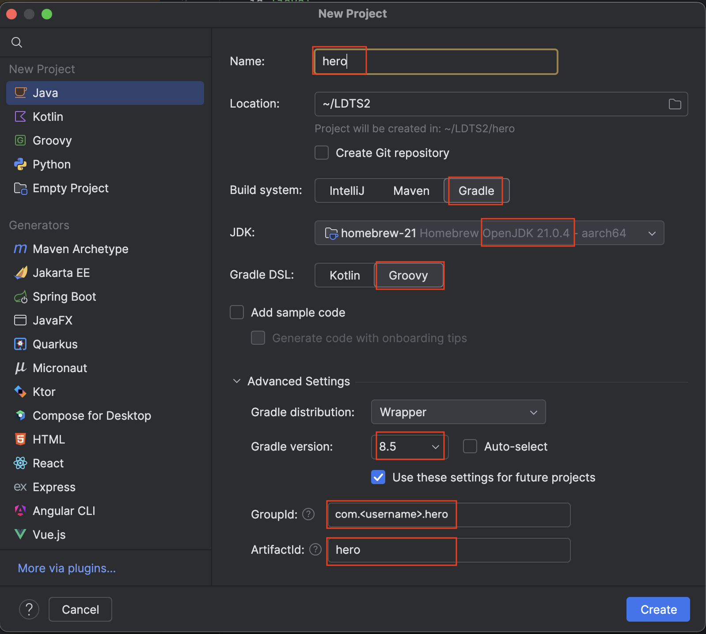

# [Software Design and Testing Laboratory](https://sigarra.up.pt/feup/en/UCURR_GERAL.FICHA_UC_VIEW?pv_ocorrencia_id=560099)


## Lab-02/03: Java / Gradle

Each lab should be submitted at GitHub classrooms. Submitted labs will be evaluated as part of the class participation component. 

### 1. Create repository at GitHub classrooms

- Open the following invite: https://classroom.github.com/a/A6fA3rLO. 
- Search you name or institucional identifier. Accept the assignment.
- Open the github repository generated:
`https://github.com/FEUP-LDTS-2024/lab-w3-java-and-gradle-<username>`. Leave it open, you will need it later.

### 2. Create Project

Open `IDEA IntelliJ` and create a new project with the following configurations:



- The lab needs to be configured to use `Java 21` and `gradle 8.5`. Lanterna does not support `Java SDK > 21`.

- [Gradle](https://gradle.org/) is a build automation tool that simplifies all build tasks, from dependency management to the actual building, running, testing and publishing.

- To use Gradle we need to choose (1) a **name** (e.g., `hero`), (2) an appropriate **location**, and, on the Artifact Coordinates section, choose (3) a **GroupId** (uniquely identifies your project across all projects and should follow the Java packages convention — e.g., `com.<username>.hero`), (4) an **ArtifactId** (a lowercase name representing your project — e.g., `hero`), and (5) a **Gradle version** (disable auto-select and select 8.5).

- Click "Finish".

### 3. Initialize Repository Locally

You should commit each step of these exercises to Git.

> :heavy_exclamation_mark: Try to commit frequently, with short and descriptive messages for each milestone. This will make your work easier to follow and debug.

###### 3.1 Initialize your repository locally

Inside `IntelliJ IDEA` open the terminal tool, third button on the bottom left menu, and run the command below.

```
git init
```

**If you use the external terminal**, you will have to `cd` the folder where you saved the project.


```shell
cd directory/of/my/project/hero
git init
```

###### 3.2 Link your local repository to remote 

Go back to point 1, open your GitHub repo generated through GitHub classrooms and copy the SSH address. It should look something like `git@github.com:FEUP-LDTS-2024/lab-w3-java-and-gradle-<your_username>.git`. Run the following command in your terminal. 

```shell
git remote add origin <github_address>
```

❗️ Don't forget to replace the `<github_address>` with the copied address.

###### 3.3 Ignore files

When committing changes to our repository, we may want to exclude files and folders generated by `IntelliJ`. We can do that by adding the names of the files and folders to the `.gitignore` file. 

`IntelliJ` should have created a `.gitignore` file on your project root. If you run the below command, you will see folders like `.idea/` in your untracked changes. 

```
git status
```

We want this folder and others to be ignored. Open the `.gitignore` file and add the following contents to the end of the file:

```shell
.idea/
.gradle/
out/
build/
*.iml
```

Verify that these are the only files that will be added to your repository using `git status`. The `.idea/` folder should not be seen in the untracked changes.

```shell
.gitignore
build.gradle
gradle/
gradlew
gradlew.bat
settings.gradle
```

###### 3.4 Commit and Push Changes

Stage and commit all changes:

```shell
git add -A
git commit -a -m "Initial version"
```

Push and track your master branch so that you only have to do `git push` next time you want to push to your remote repository.

```shell
git push -u origin master
```

The previous command may fail because:
1) You're trying to push to the wrong branch. Check the name of the branch that was generated by running `git branch`. It should show you the either `master` or `main`. Use that name in the previous command: `git push -u origin <branch_name>`.
2) Your SSH key is not yet configured. You will have to [generate your SSH key](https://docs.github.com/en/enterprise-server@3.12/authentication/connecting-to-github-with-ssh/generating-a-new-ssh-key-and-adding-it-to-the-ssh-agent#generating-a-new-ssh-key), [add the ssh key to the ssh-agent](https://docs.github.com/en/enterprise-server@3.12/authentication/connecting-to-github-with-ssh/generating-a-new-ssh-key-and-adding-it-to-the-ssh-agent#adding-your-ssh-key-to-the-ssh-agent) and [add the SSH key to your Github Account](https://docs.github.com/en/enterprise-server@3.12/authentication/connecting-to-github-with-ssh/adding-a-new-ssh-key-to-your-github-account#adding-a-new-ssh-key-to-your-account).

From now on, commit each one of the following steps into your repository.

### 4. Building and Running

❗️ Before running any `gradlew` command on your terminal, make sure you're running the right java version. If you run `java --version`, it should output `java 21`. If not, you need to configure  `JAVA_HOME` on `IntelliJ`. Go to `Settings > Tools > Terminal` and configure it as an `Environment Variable` in your **Project Settings**.

> :heavy_exclamation_mark: If IntelliJ is not using Java 21, check `File > Project Structure > Project > SDK` and set it to Java 21.

One of the features of Gradle is that it allows us to build and run our applications from the command line very easily. Try building your application by doing:

```shell
$ ./gradlew build   # or gradlew.bat build if you're using windows

BUILD SUCCESSFUL in 0s
1 actionable task: 1 executed
```

You should now have a new directory called `build` having a new `.jar` file. Jar files are how Java applications are packaged and distributed.

Now lets create an `Application` class, within the `src/main/java` directory, so we can try running using Gradle:

```java
public class Application {
    public static void main(String[] args) {
        System.out.println("Hello World!");
    }
}
```

To run our code we first need to make a few changes to the `build.gradle` file (this file controls every gradle aspect of our project).

In the plugins section add a new plugin called `application`:

```gradle
plugins {
  id 'java'
  id 'application'
}
```

And then we configure the plugin:

```gradle
application {
  mainClass.set("Application")
}
```

Whenever we change any Gradle file, we need to import those changes. IntelliJ should be asking you if you want to import these last changes. Choose "Enable Auto-Import" so you don't have to deal with this anymore.

Now, try running your application using:

```shell
./gradlew run
```

Note that gradle knows that to `run` your application it needs to _build_ it first. That's just another neat Gradle feature.

### 5. Importing Lanterna

Another feature of Gradle is the ability to easily manage dependencies.

In this project we'll be using [Lanterna](https://github.com/mabe02/lanterna), a Java library for creating text-based GUIs. You can find the line you have to add in order to include this library [here](https://mvnrepository.com/artifact/com.googlecode.lanterna/lanterna) (I just googled "lanterna gradle"). Just choose the latest version (probably 3.1.1) and then choose Gradle. You are looking for something like this:

```gradle
implementation group: 'com.googlecode.lanterna', name: 'lanterna', version: '3.1.1'
```

Add it to your build.grade dependencies section:


```gradle
dependencies {
  implementation group: 'com.googlecode.lanterna', name: 'lanterna', version: '3.1.1'
}
```

After changing your `build.gradle` you have to ask IntelliJ to load any changes. This can be done in several ways: using the shortcut Ctrl+Shift+O, clicking the cute elephant with a blue reload icon, opening the Gradle tab on the right and clicking the reload icon, and you can even set IntelliJ to reload automatically everytime this file changes by clicking the wrench icon (:wrench:) and configuring "Auto Reload Settings".

> :heavy_exclamation_mark: **Note**: Reloading Gradle can take some time...

Now we can use Lanterna in our project.


### 6. Using Lanterna

_Lanterna_ can utilize many types of terminals for different OSs. The `DefaultTerminalFactory` class creates one based on Swing (a GUI widget toolkit for Java) that should work anywhere. Let’s use that one for now.

> During these exercises don't forget to try the power of the Alt+Enter shortcut. This shortcut will try to automatically fix problems, offer suggestions and auto-complete code.

The `Screen` class simplifies the usage of Lantern terminals by allowing developers to add characters to a back panel and then swaping it with the current panel in one go. The following code initializes a `Lanterna Terminal` and a `Screen`:

```java
Terminal terminal = new DefaultTerminalFactory().createTerminal();
Screen screen = new TerminalScreen(terminal);

screen.setCursorPosition(null);   // we don't need a cursor
screen.startScreen();             // screens must be started 
screen.doResizeIfNecessary();     // resize screen if necessary
```

Start by replacing your `main(String[])` method with this code.

Both the `createTerminal()` method and the `TerminalScreen` constructor can throw a `IOException` so we have to wrap this code inside a try-catch block:

```java
try {
  Terminal terminal = new DefaultTerminalFactory().createTerminal();
  Screen screen = new TerminalScreen(terminal);

  screen.setCursorPosition(null);   // we don't need a cursor
  screen.startScreen();             // screens must be started 
  screen.doResizeIfNecessary();     // resize screen if necessary
} catch (IOException e) {
  e.printStackTrace();
}
```

If you want to set the terminal size to a certain number of columns and rows, you need to configure the terminal factory first:

```java
TerminalSize terminalSize = new TerminalSize(40, 20);
DefaultTerminalFactory terminalFactory = new DefaultTerminalFactory()
    .setInitialTerminalSize(terminalSize);
Terminal terminal = terminalFactory.createTerminal();
```

Adding a character to our screen is just a matter of calling the `setCharacter(x, y, char)` method, but before we see any changes we must call the `refresh()` method, and if we want to clear the current screen we must call the `clear()` method first:

```java
screen.clear();
screen.setCharacter(10, 10, TextCharacter.fromCharacter('X')[0]);
screen.refresh();
```

These three methods are the basis of drawing using _Lanterna_. Everytime we want to update our screen, we call clear first, we then set all the characters at their current positions and them we refresh the screen.

Add these three lines to your `main(String[])` method and try running your project. And don't forget to commit and push...

### 7. Creating the game

Until this moment we have been writing all our code inside a static method (the main method of the `Application` class). That's not very object-oriented... Let's change that:

- Create a new class called `Game`.

- Copy the code that initializes the terminal and screen to the default constructor of this new class. This time make the screen variable a class field.

- Create two new methods in this class: a private `draw()` method and public `run()` method.

- Copy the code that paints the screen (those three last lines) to the `draw()` method.

- Make the `run()` method call the `draw()` method.

- Clear the original `main(String[])` method, and inside it create a new `Game` object and call the `run()` method on it.

> :interrobang: **IMPORTANT**: There are several Lanterna methods that throw `IOException` exceptions. When developing your code, you have to decide if your class should be responsible for handling each particular exception or if it should pass it to the calling method by declaring that it throws that kind of exception. Catching an exception should only be done if your method knows how to handle it properly.

For example, if you don't want your `draw()` method to catch and handle any `IOException` then just throw the exception like this:

```java
private void draw() throws IOException {
// ...
}
```

Take a moment to understand how exceptions work and how you should handle them. Ask your teacher if you need help with that.

Don't forget to commit and push your work regularly.

### 8. Reading keystrokes

Add two new fields to the Game class:

```java
private int x = 10;
private int y = 10;
```

And now, instead of drawing an `X` in position (10, 10), let's draw it in position `(x, y)`:

```java
screen.setCharacter(x, y, TextCharacter.fromCharacter('X')[0]);
```

The screen `readInput()` method waits for a key stroke pausing until it gets one:

```java
KeyStroke key = screen.readInput();
```

Create a private `processKey(KeyStroke)` method. This method should receive a `KeyStroke` and print it:

```java
private void processKey(KeyStroke key) {
  System.out.println(key);
}
```

In your `run()` method: 1) call the `draw()` method, 2) read a key stroke and 3) send it to the `processKey(KeyStroke)` method.

Run your code and try pressing some key (e.g. the arrow up key) and you should get the following result in the console:

```shell
KeyStroke{keytype=ArrowUp}
```

As you can see, _Lanterna_ detected that you pressed the `ArrowUp` key and returned a `KeyStroke` containing that information. You can now test the key within the processKey() method:

```java
if (key.getKeyType() == KeyType.ArrowUp)
  // ...
```

If the pressed key is a normal character key, then `KeyType` will be `Character` and you can check which character was pressed like this:

```java
if (key.getKeyType() == KeyType.Character && key.getCharacter() == 'q')
  // ...
```

1. Change the `processKey(KeyStroke)` code so that depending on the arrow key pressed (up, right, down, left) the variables `x` and `y` change accordingly (e.g. if the `ArrowLeft` key is pressed, then `x` should be decremented by `1`). 

> :heavy_exclamation_mark: **Note**: Try using a switch-clause instead of a bunch of if-clauses; remember that `Alt+Enter` is your friend if you need help.

2. Wrap all method calls in the body of the `run()` method with an infinite while loop, so that you can also detect subsequent key presses and not just one.

3. After reading the key, verify if it is `q`, if it is then close the `Screen`. If it is `KeyType.EOF` (end of file because the window was closed), then break from the loop.

Test your code. You should now have a moving `X` char. Welcome our Hero!

> Make sure that, when you close the terminal window, if you'e running from IntelliJ, the following is printed in the console: "Process finished with exit code 0".
>
> If it isn't, then your process is still running and there is something wrong with your code. To stop your process, press the stop button in the top bar of IntelliJ.

### 9. The Hero Class

Create a new class for our hero called, well, Hero.

Add some fields `x` and `y` to our hero and initialize them in the constructor so that you can create a new Hero like this:

```java
Hero hero = new Hero(10, 10);
```

Make sure you have setters and getters for the x and y fields (use `Alt+Enter` to create them).

In our Game class, replace the `x` and `y` fields by a new hero field and initialize it in the constructor:

```java
hero = new Hero(10, 10);
```

Change whatever code you need in the Game class, to use the newly created Hero class. Also replace incrementing and decrementing the `x` and `y` fields with calls to new `moveUp()`, `moveRight()`, `moveDown()` and `moveLeft()` methods in the Hero class.

Don't forget that a real hero should know how to draw himself:

```java
public class Game {
  // ...
  private void draw() throws IOException {
    screen.clear();
    hero.draw(screen);
    screen.refresh();
  }
  // ...
}
```

### 10. Position

Create a new class called Position. This class will have two fields `x` and `y`. Generate getters and setters for both these fields.

Replace the `x` and `y` fields in the Hero class with a new position field. So, instead of:

```java
public class Hero {
    private int x;
    private int y;
    //...
```

We will have:

```java
public class Hero {
  private Position position;
    //...
```

Replace all getters and setters for the old fields for new getters and setters for the `Position` class.

Change the `moveX()` methods so that instead of moving the hero they return a new desired position leaving the actual moving to be done by the game. For example:

```java
public Position moveUp() {
    return new Position(position.getX(), position.getY() - 1);
}
```

In the `Game` class, change the calls like this one:

```java
if (key.getKeyType() == KeyType.ArrowUp) hero.moveUp();
```

To something like:

```java
if (key.getKeyType() == KeyType.ArrowUp) moveHero(hero.moveUp());
```

Where `moveHero(Position)` is just a method that moves the hero to the new position:

```java
private void moveHero(Position position) {
  hero.setPosition(position);
}
```

This way we can later control if the hero can actually move to that new position.

### 11. Enter the Arena

Create a new `Arena `class with width and height fields. Also add a constructor receiving these same parameters. This is where our `Hero` will live. So we have to move him there.

This means that our game will now have an `Arena` and that our `Arena` will have an `Hero`. All calls to the `Hero` class should now be done by means of the `Arena` class:

```java
private void processKey(KeyStroke key) {
    arena.processKey(key);
}

private void draw() throws IOException {
    screen.clear();
    arena.draw(screen);
    screen.refresh();
}
```

Now that we have an `Arena` we can constrain the `Hero` to be inside it. Let's make our `moveHero(Position)` method verify if the hero can move there first:

```java
public void moveHero(Position position) {
    if (canHeroMove(position))
        hero.setPosition(position);
}
```

Make the `canHeroMove(Position)` return true if the position is inside the `Arena` (using the `width` and `height` fields) and false otherwise.

### 12. Paint the floor

Let’s now paint the `Arena` floor in a nice color.

`TextGraphics` is an auxiliary class that can be constructed from the `Screen` class that can do more complex character manipulations (like drawing lines and rectangles). To obtain a `TextGraphics` object just do:

```java
TextGraphics graphics = screen.newTextGraphics();
```

We can set the background color of the `TextGraphics` object and draw a rectangle like this:

```java
graphics.setBackgroundColor(TextColor.Factory.fromString("#336699"));
graphics.fillRectangle(new TerminalPosition(0, 0), new TerminalSize(width, height), ' ');
```

Use this new knowledge to paint the `Arena` floor any color you like.

To make things easier, we should create the `TextGraphics` object when we draw the `Game` and pass it to the draw methods from the `Hero` and `Arena` classes instead of passing the Screen. This way, the `Arena` and `Hero` classes will have a more useful tool to draw themselves.

```java
private void draw() throws IOException {
    screen.clear();
    arena.draw(screen.newTextGraphics());
    screen.refresh();
}
```

Let's go ahead and also change our Hero color. And, what the heck, let's make him **BOLD** — he's a hero after all.

```java
public void draw(TextGraphics graphics) {
    graphics.setForegroundColor(TextColor.Factory.fromString("#FFFF33"));
    graphics.enableModifiers(SGR.BOLD);
    graphics.putString(new TerminalPosition(position.getX(), position.getY()), "X");
}
```

Note that, the way we have organized our code, it is very easy to make our game bigger just by changing these two lines in the draw methods in the `Arena` and `Hero` class:

```java
graphics.fillRectangle(new TerminalPosition(0, 0), new TerminalSize(width * 2, height * 2), ' ');
graphics.putString(new TerminalPosition(position.getX() * 2, position.getY() * 2), "\\/");
graphics.putString(new TerminalPosition(position.getX() * 2, position.getY() * 2 + 1), "/\\");
```

But let’s leave it smaller for now...

### 13. Walls

Create a new class called `Wall`. This class is going to be very similar to the `Hero` class but it won't be able to move and will be drawn with a different character or color.

Instead of having only one `Wall` in our `Arena`, we are going to want to have many. Let's try using an `ArrayList` to store all these walls. We start by declaring a new walls field in our `Arena`:

```java
private List<Wall> walls;
```

Note that we used List instead of ArrayList. List is the interface that all lists implement and ArrayList is a concrete instantiation of a class.

> This is the "Return the most specific type, accept the most generic type" principle.

To create the walls, let's use a new method. Call it inside the `Arena` constructor:

```java
this.walls = createWalls();
```

And then define it like this:

```java
private List<Wall> createWalls() {
    List<Wall> walls = new ArrayList<>();

    for (int c = 0; c < width; c++) {
        walls.add(new Wall(c, 0));
        walls.add(new Wall(c, height - 1));
    }

    for (int r = 1; r < height - 1; r++) {
        walls.add(new Wall(0, r));
        walls.add(new Wall(width - 1, r));
    }

    return walls;
}
```

Don't forget the walls when drawing the arena:

```java
for (Wall wall : walls)
    wall.draw(graphics);
```

The last thing we need to do is to modify the `canHeroMove(Position)` methods so that the hero does not go inside walls. Do that yourself!

### 14. Better Collision Detection

In the last step you ended by verifying if the `Hero` entered a `Wall`. You probably did something like this:

```java
if (wall.getPosition().getX() == position.getX() &&
    wall.getPosition().getY() == position.getY())
  // ...
```

Wouldn't it be much nicer if you could just do:

```java
if (wall.getPosition().equals(position)) 
  // ...
```

The `equals(Object)` method is a method declared by the `Object` class that any class can override. The original method only checks if both objects are the same but we want something a little bit more sophisticated. Normally, it is done like this:

```java
@Override
public boolean equals(Object o) {
    if (this == o) return true;

    if (o == null) return false;

    if (getClass() != o.getClass()) return false;

    Position p = (Position) o;
    return x == p.getX() && y == p.getY();
}
```

This is still not incredibly efficient. Every time the `Hero` moves, we must go through every `Wall` to see if the `Wall` is on his way. But let's leave it like that for now...

### 15. Walls and Heroes have so much in common

As we've seen in a previous step:

> “A Wall is basically a Hero that cannot move” — Someone, 2019.

Create an abstract class called `Element` that is a generalization of these two classes. This new class should have a constructor, methods to deal with its position and an abstract `draw` method. Make both classes, `Hero` and `Wall`, extend this class.

### 16. Coins

Create a new `Element` class called `Coin` just like we did with the `Wall`. `Coin`s should just have a different way of drawing themselves.

But let's place our coins in random places:

```java
private List<Coin> createCoins() {
    Random random = new Random();
    ArrayList<Coin> coins = new ArrayList<>();
    for (int i = 0; i < 5; i++)
        coins.add(new Coin(random.nextInt(width - 2) + 1, random.nextInt(height - 2) + 1));
    return coins;
}
```

Don't forget the coins when drawing the arena:

> :heavy_plus_sign: **Extra**: Make sure no `Coin` is on top of another or on top of the `Hero`.

When the hero moves, verify if he landed on a coin. If he did, remove that coin from the list of coins. Do this inside a new method called `retrieveCoins()`.

> You should **not** modify a `List` (or any other data structure for that matter) at the same time you are looping over it. In this case we can just break from the loop as soon as we remove a coin but in other situations you have to devise a better strategy.

### 17. Monsters

Create a new `Monster` class that extends the `Element`. As with other `Element` classes, a `Monster` also is drawn in some different way. It should also have a method called `move()` that returns a position adjacent to his own position.

Every time you process a key, all monsters move one position. Do this inside a new method called `moveMonsters()`.

Every time the `Hero` touches a `Monster` the game should terminate and a message should be printed to the console. Do this inside a method called `verifyMonsterCollisions()`. Note: You might need to do it twice...

Don't forget to draw the monsters...

### 18. Some more stuff

Other things you can do at home :house::

- Organize the code into packages.

- The hero could have some energy that would be drained as he touches monsters instead of dying immediately.

- There could be more types of monsters with different moving techniques.

- The map of the arena could be stored in a file and read when the game starts.

- Have different rooms each with its own map, number of coins, number of monsters and doors to go from one room to the other.

- Doors could only show after all coins have been collected.

- Keep the player's score.

- Show messages in the game screen when the player loses or beats the game.

- Allow the player to restart the game after losing.


