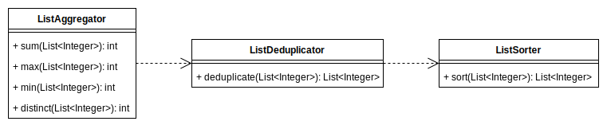
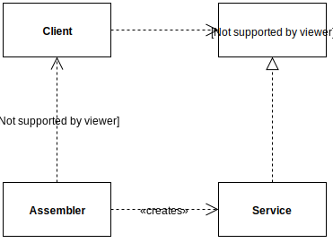

# [Software Design and Testing Laboratory](https://sigarra.up.pt/feup/en/UCURR_GERAL.FICHA_UC_VIEW?pv_ocorrencia_id=501676)


## Lab-04/05/06: Unit Testing with JUnit and Spock

All labs must be submitted via GitHub Classroom. Submitted labs will be assessed as part of the class participation grade.

### 1. Create repository at GitHub classrooms

- Open the following invite: https://classroom.github.com/a/HBpnMMdv. 
- Search you name or institucional identifier. Accept the assignment.
- Open the github repository generated:
`https://github.com/FEUP-LDTS-2024/lab-w4-unit-testing-<username>`. Leave it open, you will need it later.


### 2. Project Setup

- **Download** and **unzip** the following [project](https://moodle2526.up.pt/mod/resource/view.php?id=45769) into a suitable folder on your computer.
- Launch **IntelliJ**, then **open** the project.
- To Run all tests, navigate to `src/test/java`, **right-click** and choose **“Run Tests in 'numbers.test'”**.
- Ensure that all tests **pass**. If necessary, enable the display of passing tests by clicking the checkmark (✔️) icon.
- Initialize a Git repository by running `git init` in the terminal. 
- Be sure to exclude unnecessary files (like `.idea/`) from version control. If there is no `.gitignore` file at the root of the project, create one.
    ```
    .idea/
    .gradle/
    out/
    build/
    *.iml
    ```
- Connect your local repository to the remote by running `git remote add origin <remote_address>`. The remote address should resemble: `git@github.com:FEUP-LDTS-2024/lab-w5-unit-testing-<your_username>.git`. (Refer to the steps from our last lab if needed). After linking, don't forget to commit your changes and push them to the remote repository.

### 3. Inspect and Analyze the Project

The project includes three key classes:

- `ListAggregator`: Provides methods to perform various calculations on lists of integers, such as computing the **sum**, **minimum**, **maximum**, and **distinct** values. The `distinct()` method returns the count of unique numbers in the list.
- `ListDeduplicator`: Removes duplicate entries from a list of integers.
- `ListSorter`: Sorts a list of integers in order.



The `distinct` method in the `ListAggregator` class **relies** on the `ListDeduplicator` class to calculate the number of unique elements in a list.

Additionally, the `ListDeduplicator` class **depends** on the `ListSorter` class, as removing duplicates is more efficient when the list is already sorted. [[Why is this important? Remember the concept of Test Isolation#Slide 20](https://web.fe.up.pt/~arestivo/slides/?s=unit-testing#20)]

### 4. Simplify Test Setup

Take a moment to observe that our test methods are **structured** around **three distinct phases** (the 3 As):

- **Arrange**: This phase involves setting up the test and organizing the necessary data.
- **Act**: The method being tested is invoked.
- **Assert**: A single logical assertion is made to verify the outcome.

You’ll notice that the setup for the `ListAggregator` tests remains consistent throughout.

```java
List<Integer> list = Arrays.asList(1,2,4,2,5);
```

##### 4.1 Do **one of two** things

- Create a **helper method** that can be **called** from **each test** to return the list to be tested. This approach is preferable if you are using different values in each test.
```java
public class ListAggregatorTest {

    // Helper method to return a list for testing
    private List<Integer> getTestList() {
        return ...;
    }

    @Test
    public void testSum() {
        List<Integer> numbers = getTestList();
        ...
    }
}
```
- Implement a **helper** method with a `@BeforeEach` **annotation** that sets up the list as an attribute. Methods annotated with `@BeforeEach` are executed before **each test**. Not sure how `@BeforeEach` works? [Unit Testing Class#Slide 18](https://web.fe.up.pt/~arestivo/slides/?s=unit-testing#18).
```java
public class ListAggregatorTest {

    private List<Integer> numbers;

    // Set up the list before each test
    @BeforeEach
    public void setUp() {
        numbers = ...
    }

    @Test
    public void testSum() {
        int sum = ListAggregator.sum(numbers);
        assertEquals(15, sum);
    }
}
```

**Summary:**
- In **Option 1**, the helper method is called directly in each test to provide the necessary list.
- In **Option 2**, the `@BeforeEach` annotation initializes the list before each test, making it accessible as an instance variable.

##### 4.2 Other Test Classes

Apply the same approach to **the other test classes**, ensuring that all tests **continue to pass**. To do this, navigate to `src/test/java`, right-click, and select the `Run 'Tests in 'numbers.test''` option.

##### 4.3 Try Making a Test to Fail


Next, open the `ListSorterTest` class and modify the line `list = Arrays.asList(3, 2, 6, 1, 4, 5, 7);` to `list = Arrays.asList(3, 2, 6, 1, 4, 5, 6);`. Note that this change will cause list to differ from the expected list, resulting in one of the tests failing. ❌

After that, revert the changes and run the tests again. All tests should pass successfully. ✅

### 5. Corner Cases

You received a **bug report**!

```
Bug report #7263

I am encountering an incorrect maximum
result for the following list of
numbers: -1, -4, and -5. The max
function returns 0 instead of -1. There
seems to be an issue!
```

Let’s write a test case in `ListAggregatorTest.java` to address this bug report:

- Create a test method named `max_bug_7263` that confirms the bug. 
- Ensure that the `assertEquals` statement reflects the intended program behavior, meaning the expected maximum value should be `-1`.
- Run the test and observe that it **fails** ❌.
- **Fix** the **code** to **ensure** that the test passes ✅.


### 6. Distinct

You received a new **bug report**!

```
Bug report #8726

I am receiving an incorrect count of
distinct values for the following list 
of numbers: 1, 2, 4, and 2. The distinct 
function returns 4 instead of the 
expected 3. There seems to be an issue!
```
##### 6.1 Create the test

Let's write the test case for the bug report on `ListAggregatorTest.java`.

- Start by creating a **test** that **confirms** the **bug**. Call it `distinct_bug_8726`.
- Ensure that the `assertEquals` statement reflects the intended program behavior, meaning the expected number of distinct values should be `3`.
- Run the test and observe that it **fails** ❌.

##### 6.2 Inspect the issue

Let's now look into the problem. 🔍 Open 
the `ListAggregator.distinct()` code. 

> :heavy_exclamation_mark: **Spoiler alert**: you won’t find anything wrong…

The **issue** is that when we test the `distinct()` method, we are indirectly testing its dependency, the `ListDeduplicator.deduplicate()` method. To ensure accurate testing, we need to isolate these components and test them independently, following the principles of **test isolation**.

##### 6.3 How could we fix the test?


To test the `distinct()` and the `deduplicate()` methods **independently** from each other, we must go from a design that looks like this:


To something like this:



Where the **client** (`ListAggregator`) should depend on an **interface** (let's name it `GenericListDeduplicator`), rather than a concrete implementation.

```java
public interface GenericListDeduplicator {
    // ...
}
```

```java
public class ListDeduplicator implements GenericListDeduplicator {
    // ...
}
```

An `Assembler` class (in this case, `ListAggregatorTest`) will be responsible for creating the concrete implementation of the **service** (such as `ListDeduplicator`) and injecting it into the **client** (`ListAggregator`). 

```java
ListDeduplicator dedup = new ListDeduplicator();
int distinct = aggregator.distinct(Arrays.asList(1, 2, 4, 2), dedup);
```
This approach promotes flexibility and decouples the components, allowing for easier testing and future modifications.

This technique is known as **[Dependency Injection](https://web.fe.up.pt/~arestivo/slides/?s=unit-testing#21)**. It allows our test to inject into the `ListAggregator` any list deduplicator **service**, including one that always returns a predefined response (as explained in **Stub**, [Unit Testing Class#Slide 23](https://web.fe.up.pt/~arestivo/slides/?s=unit-testing#23)).

##### 6.4 Let's fix the test

To remove the dependency between the `ListAggregatorTest` and the `ListDeduplicator` class using a **stub**, we first need to:

- In the source code, create a `GenericListDeduplicator` interface that defines the `deduplicate()` method, which accepts a list of integers.
- Modify the `ListAggregator.distinct()` method to accept any class that implements the `GenericListDeduplicator` interface.
- Implement the `GenericListDeduplicator` interface in the `ListDeduplicator` class.
- Update the tests to inject a `ListDeduplicator` instance into the `distinct()` method for proper test execution.

And, then create the **Stub**:

- Create a **stub** that always returns the correct result for the data being tested. Implement it as an **inner-class** within the `ListAggregatorTest.distinct()` method. For example:
```java
    class Stub extends ListDeduplicator {
        @Override
        public List<Integer> deduplicate(List<Integer> list) {
            return valueToReturn; // Return the distinct elements
        }
    }
```
- Update both `distinct()` tests to inject a **stub** class. This ensures that both tests will **pass** consistently. ✅

This did **not fix** any bug; we merely **corrected** the failing test, as it wasn't the one that should have failed. To properly fix the issue in our code, we still need to:


- Create tests for `sort` and `deduplicate`, using the same values: `1, 2, 4 and 2`.
- Make sure to use **Dependency Injection** in the `ListDeduplicator()` method as it also depends on the `sort()` method.
- **Fix** the code that **needs fixing**. Only **one** of the tests should be failing now. Fix the bug in the function `sort()`. This function is not behaving properly.
> Hint: Look at the inner loop boundaries.

### 7. Mockito

Redo the previous exercise but this time use [Mockito](https://site.mockito.org/) to create the stubs.

To use **Mockito**, you must first add this to the dependencies on your **build.gradle** file:

```gradle
  testImplementation 'org.mockito:mockito-core:3.7.7'
```

Creating a deduplicator using Mockito, should look like this:

```java
GenericListDeduplicator deduplicator = Mockito.mock(GenericListDeduplicator.class);
```

Making the stub return the correct list can then be done like this:

```java
  Mockito.when(deduplicator.deduplicate(Mockito.anyList())).thenReturn(Arrays.asList(1, 2, 4));
```

Want to learn more? [Unit Testing#Slide 26](https://web.fe.up.pt/~arestivo/slides/?s=unit-testing#26)

### 8. COVERAGE

- Run all tests again, but this time **right-click** on `src/test/java`, and select **“Run All Tests with Coverage”**.

The report should appear on the right side of the screen.

Enter inside the **com** package, then inside the **aor** and **numbers** packages and verify if all classes, methods and lines are covered by your tests. If not add more tests until they are.

### 9. FILTERS

Create a new class `ListFilterer` that will be capable of **filtering** a **list of numbers**. This class should have a **constructor** that **receives a filter**:

```java
  public ListFilterer(GenericListFilter filter) { ... }
```

And single method called `filter` with the following **signature**:

```java
  public List<Integer> filter(List<Integer> list);
```

As you can see, this method **returns** a **list of numbers** that have been **filtered** by a certain **filter** (**Dependency Injection** again).

The `GenericListFilter` interface, should have only one method that returns true if a certain number should be accepted for that filter and false otherwise:

```java
  public boolean accept(Integer number);
```

Create **two classes** that follow this interface: `PositiveFilter` (that accepts only **positive** numbers) and `DivisibleByFilter` (that receives an **integer** upon construction and accepts only numbers **divisible** by that number).

- Create tests for all these classes (`ListFilterer`, `PositiveFilter` and `DivisibleByFilter`).
- Use **stubs** when necessary.
- Verify the test **coverage** again.

### 10. Mutation Testing

Test coverage allows us to **access** the **percentage** of lines **covered** by our **tests** but it does not verify the **quality** of those tests.

**Mutation** testing tries to **mitigate** this problem by creating **code mutations** (that should not pass the tests) and **verifying** if any of those mutations **survive** our test suite.

To use **PIT** (a **test mutation system** for **Java**) we must first add the following line to the **plugin section** of our **build.gradle** file:

```gradle
  id 'info.solidsoft.pitest' version '1.15.0'
```

Also add the following section anywhere in your **build.gradle** file:

```gradle
pitest {
  junit5PluginVersion = '1.0.0'
}
```

By default, **PIT** runs all tests **under** the **package** with the **same name** as the **group** defined in your **build.gradle** file. So if all your classes and tests are under the **com.aor.numbers** package, no other configuration should be necessary.

**PIT** should have **automatically** created a **gradle** **task** called **pitest** that you can execute by doing (or using the IntelliJ gradle panel):

```bash
./gradlew pitest
```

This will run **PIT** and create a **report** under `build/reports/pitest/<date>`. You can open this report using your **browser** and check if any mutations **survived**. You should see something like the following report:


Try **improving** your tests so **all mutations die**.

### 11. Hero Testing

- With your new found knowledge, create **tests** for the `Hero` code you created last class.
- Try using **Dependency Injection** to **remove** the **dependency** between your `Element` classes and the **lanterna** library.
- Try using **Mocks**, with **Mockito**, to test if the correct **lanterna** **functions** are being **called** by your code.
- Verify the **coverage** of your tests.
- Try **mutation** testing and **improve** the results by writing **more** and **better** tests.

### 12. Advanced Material: Spock Testing Framework

Next, we'll take a look at **[Spock](http://spockframework.org/)**, a [Groovy](http://groovy-lang.org/) testing framework. Mainly, Spock aims to be a more powerful alternative to the traditional JUnit stack, by leveraging Groovy features.

Groovy is a JVM-based language which seamlessly integrates with Java. On top of interoperability, it offers additional language concepts such as being a dynamic, having optional types and meta-programming.

By making use of Groovy, Spock introduces new and expressive ways of testing  Java applications, which simply aren't possible in ordinary Java code. We'll explore some of Spock's high-level concepts next, with some practical step by step examples.

#### 12.1 Gradle Dependency

To use spock, one must first add the following dependencies into Gradle. We also need a dependency on Groovy, since Spock tests are written in Groovy. We’re only going to use Groovy for testing, so we’ll declare this as testImplementation too.

> :heavy_exclamation_mark:  You can delete the other JUnit dependencies since we don’t need them.

Your `build.gradle` dependencies should look like:

```gradle
dependencies {
    testImplementation 'org.spockframework:spock-core:2.0-groovy-3.0'
    testImplementation 'org.codehaus.groovy:groovy-all:3.0.21'
}
```

Since we’re using Groovy, we need to add the groovy plugin to Gradle. When we’re using the Groovy plugin, we don’t need to specifically add the Java plugin as well, since all that functionality is included in the Groovy plugin. We might want to delete java plugin just to keep the noise down in our build file. We can keep the plugin to be explicit, or delete it to be more succinct, it’s really down to our own preferences.

```gradle
plugins {
    id 'groovy'
}
```

#### 12.2 Structure of a Spock Test

**Specification and Features**

As we are writing our tests in Groovy, we need to add them to the `src/test/groovy` directory, instead of `src/test/java`. Let's create our first test in this directory, naming it `FirstSpecification.groovy`:

```groovy
class FirstSpecification extends Specification {

}
```

Note that we are extending the `Specification` interface. Each Spock class must extend this in order to make the framework recognize it. It's doing so that allows us to implement our first *feature*:

```groovy
def "one plus one should equal two"() {
  expect:
  	1 + 1 == 2
}
```

Before explaining the code, it's also worth noting that in Spock, what we refer to as a feature is somewhat synonymous to what we see as a test in JUnit. So whenever we refer to a feature we are actually referring to a test.

Now, let's analyze our feature. We should immediately be able to note some differences between it and Java.

The first difference is that the feature method name is written as an ordinary string. In JUnit, we would have had a method name which uses camelcase or underscores to separate the words, which would not have been as expressive or human readable.

The next is that our test code lives in an expect block. We will cover blocks in more detail shortly, but essentially they are a logical way of splitting up the different steps of our tests.

Finally, we realize that there are no assertions. That's because the assertion is implicit, passing when our statement equals true and failing when it equals false. Again, we'll cover assertions in more details shortly.

**Blocks**

Sometimes when writing JUnit a test, we might notice there isn't an expressive way of breaking it up into parts. For example, if we were following behavior driven development, we might end up denoting the *given-when* then parts using comments:

```java
@Test
public void givenTwoAndTwo_whenAdding_thenResultIsFour() {
   // Given
   int first = 2;
   int second = 4;

   // When
   int result = 2 + 2;

   // Then
   assertTrue(result == 4)
}
```

Spock addresses this problem with blocks. Blocks are a Spock native way of breaking up the phases of our test using labels. They give us labels for given when then and more:

- **Setup** (Aliased by **Given**) – Here we perform any setup needed before a test is run. This is an implicit block, with code not in any block at all becoming part of it
- **When** – This is where we provide a stimulus to what is under test. In other words, where we invoke our method under test
- **Then** – This is where the assertions belong. In Spock, these are evaluated as plain boolean assertions, which will be covered later
- **Expect** – This is a way of performing our stimulus and assertion within the same block. Depending on what we find more expressive, we may or may not choose to use this block
- **Cleanup** – Here we tear down any test dependency resources which would otherwise be left behind. For example, we might want to remove any files from the file system or remove test data written to a database

Let's try implementing our test again, this time making full use of blocks:

```groovy
def "two plus two should equal four"() {
    given:
        int left = 2
        int right = 2

    when:
        int result = left + right

    then:
        result == 4
}
```

As we can see, blocks help our test become more readable.

#### 12.3 Leveraging Groovy Features for Assertions

> :heavy_exclamation_mark:  Within the then and expect blocks, assertions are implicit.

Mostly, every statement is evaluated and then fails if it is not true. When coupling this with various Groovy features, it does a good job of removing the need for an assertion library. Let's try a list assertion to demonstrate this:

```groovy
def "Should be able to remove from list"() {
    given:
        def list = [1, 2, 3, 4]

    when:
        list.remove(0)

    then:
        list == [2, 3, 4]
}
```

While we're only touching briefly on Groovy in this lecture, it's worth explaining what is happening here.

First, Groovy gives us simpler ways of creating lists. We can just able to declare our elements with square brackets, and internally a list will be instantiated.

Secondly, as Groovy is dynamic, we can use def which just means we aren't declaring a type for our variables.

Finally, in the context of simplifying our test, the most useful feature demonstrated is operator overloading. This means that internally, rather than making a reference comparison like in Java, the equals() method will be invoked to compare the two lists.

It's also worth demonstrating what happens when our test fails. Let's make it break and then view what's output to the console:

```shell
Condition not satisfied:

list == [1, 3, 4]
|    |
|    false
[2, 3, 4]
 <Click to see difference>

at FirstSpecification.Should be able to remove from list(FirstSpecification.groovy:30)
```

While all that's going on is calling `equals()` on two lists, Spock is intelligent enough to perform a breakdown of the failing assertion, giving us useful information for debugging.

#### 12.4 Asserting Exceptions

Spock also provides us with an expressive way of checking for exceptions. In JUnit, some our options might be using a try-catch block, declare expected at the top of our test, or making use of a third party library. Spock's native assertions come with a way of dealing with exceptions out of the box:

```groovy
def "Should get an index out of bounds when removing a non-existent item"() {
    given:
        def list = [1, 2, 3, 4]
 
    when:
        list.remove(20)

    then:
        thrown(IndexOutOfBoundsException)
        list.size() == 4
}
```

Here, we've not had to introduce an additional library. Another advantage is that the thrown() method will assert the type of the exception, but not halt execution of the test.

#### 12.5 Using Datatables in Spock

One easy win for Spock when compared to JUnit is how it cleanly it implements parameterized tests. Again, in Spock, this is known as **Data Driven Testing**. Now, let's implement the same test again, only this time we'll use Spock with **Data Tables**, which provides a far more convenient way of performing a _parameterized test_:

> :heavy_exclamation_mark: Essentially, **data driven testing** is when we test the same behavior multiple times with different parameters and assertions. A classic example of this would be testing a mathematical operation such as squaring a number. Depending on the various permutations of operands, the result will be different. In Java, the term we may be more familiar with is parameterized testing.

```groovy
def "numbers to the power of two"(int a, int b, int c) {
  expect:
      Math.pow(a, b) == c

  where:
      a | b | c
      1 | 2 | 1
      2 | 2 | 4
      3 | 2 | 9
  }
```

As we can see, we just have a straightforward and expressive Data table containing all our parameters.

Also, it belongs where it should do, alongside the test, and there is no boilerplate. The test is expressive, with a human-readable name, and pure expect and where block to break up the logical sections.

#### 12.6 Mocking

**Mocking Using Spock**

Spock has it's own mocking framework, making use of interesting concepts brought to the JVM by Groovy. To guide you through the process of creating a mock, lets use the test we created before to test bug #8726.

```java
@Test
public void distinct_bug_8726() {
	ListAggregator aggregator = new ListAggregator();

	GenericListDeduplicator deduplicator = Mockito.mock(GenericListDeduplicator.class);
  Mockito.when(deduplicator.deduplicate(Mockito.anyList())).thenReturn(Arrays.asList(1, 2, 4));

  int distinct = aggregator.distinct(Arrays.asList(1, 2, 4, 2), deduplicator);

  Assertions.assertEquals(3, distinct);
}
```

First, let's instantiate a `Mock`:

```groovy
GenericListDeduplicator deduplicator = Mock(GenericListDeduplicator)
```

In this case, the type of our mock is inferred by the variable type. As Groovy is a dynamic language, we can also provide a type argument, allow us to not have to assign our mock to any particular type:

```groovy
def deduplicator = Mock(GenericListDeduplicator)
```

Now, whenever we call a method on our PaymentGateway mock, a default response will be given, without a real instance being invoked:

```groovy
when:
    def result = deduplicator.deduplicate(Arrays.asList(1, 2, 4, 2))

then:
    result == null
```

The term for this is _lenient mocking_. This means that mock methods which have not been defined will return sensible defaults, as opposed to throwing an exception. This is by design in Spock, in order to make mocks and thus tests less brittle.

**Stubbing Method Calls on Mocks**

We can also configure methods called on our mock to respond in a certain way to different arguments. Let's try getting our `GenericListDeduplicator` mock to return the list `[1,2,4]` when we invoked with `[1,2,4,2]`:

```groovy
given:
  	def deduplicator = Mock(GenericListDeduplicator)
    deduplicator.deduplicate(Arrays.asList(1, 2, 4, 2)) >> Arrays.asList(1, 2, 4)

when:
    def result = deduplicator.deduplicate(Arrays.asList(1, 2, 4, 2))

then:
    result == Arrays.asList(1,2,4)
```

What's interesting here, is how Spock makes use of Groovy's operator overloading in order to stub method calls. With Java, we have to call real methods, which arguably means that the resulting code is more verbose and potentially less expressive.

Now, let's try a few more types of stubbing.

If we stopped caring about our method argument and always wanted to return true, we could just use an underscore:

```groovy
deduplicator.deduplicate(_) >> Arrays.asList(1, 2, 4)
```

If we wanted to alternate between different responses, we could provide a list, for which each element will be returned in sequence:

```
deduplicator.deduplicate(_) >>> [Arrays.asList(1, 2, 4), Arrays.asList(6, 7)]
```

There are more possibilities, and these are left for your own investigations!

**Verification**

Another thing we might want to do with mocks is assert that various methods were called on them with expected parameters. In other words, we ought to verify interactions with our mocks.

A typical use case for verification would be if a method on our mock had a `void` return type. In this case, by there being no result for us to operate on, there's no inferred behavior for us to test via the method under test. Generally, if something was returned, then the method under test could operate on it, and it's the result of that operation would be what we assert.

Let's try verifying that a method with a void return type is called:

```groovy
def "Should verify notify was called"() {
    given:
        def notifier = Mock(Notifier)

    when:
        notifier.notify('foo')

    then:
        1 * notifier.notify('foo')
}
```

Spock is leveraging Groovy operator overloading again. By multiplying our mocks method call by one, we are saying how many times we expect it to have been called.

If our method had not been called at all or alternatively had not been called as many times as we specified, then our test would have failed to give us an informative Spock error message. Let's prove this by expecting it to have been called twice:

```groovy
2 * notifier.notify('foo')
```

Following this, let's see what the error message looks like. We'll that as usual; it's quite informative:

```shell
Too few invocations for:

2 * notifier.notify('foo')   (1 invocation)
```

Just like stubbing, we can also perform looser verification matching. If we didn't care what our method parameter was, we could use an underscore:

```groovy
2 * notifier.notify(_)
```

Or if we wanted to make sure it wasn't called with a particular argument, we could use the not operator:
```groovy
2 * notifier.notify(!'foo')
```

Again, there are more possibilities, and these are left for your own investigations!

### 13. Hero Testing with Spock

Re-implement your tests, now using Spock and Spock Mocking. 

### 13. Other resources:

- https://blog.jetbrains.com/idea/2021/01/tutorial-spock-part-1-getting-started/