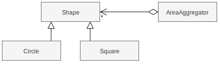
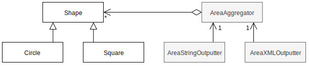
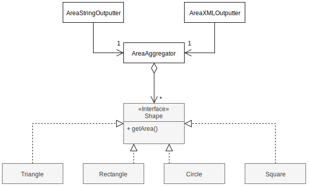
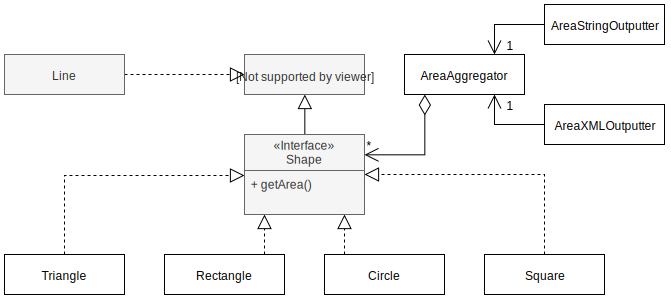
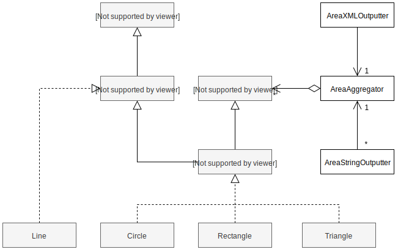
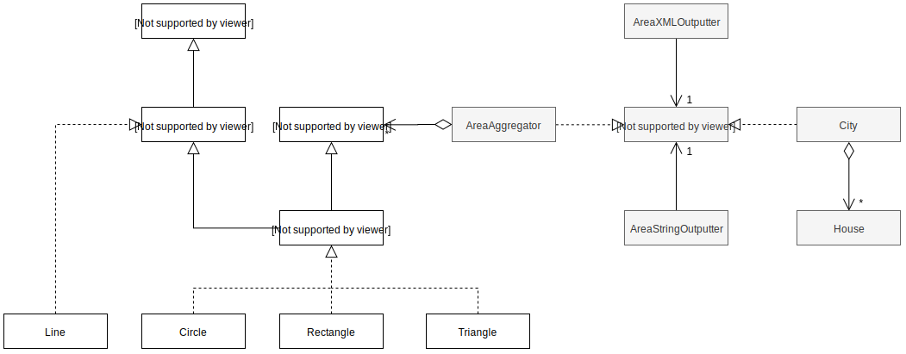

# [Software Design and Testing Laboratory](https://sigarra.up.pt/feup/en/UCURR_GERAL.FICHA_UC_VIEW?pv_ocorrencia_id=560099)

All labs must be submitted via GitHub Classroom. Submitted labs will be assessed as part of the class participation grade.

#### Create repository at GitHub classrooms

- Open the following invite: https://classroom.github.com/a/QHjS_KEB. 
- Search you name or institucional identifier. Accept the assignment.
- Open the github repository generated:
`https://github.com/FEUP-LDTS-2024/lab-w8-solid-principles-<username>`. Leave it open, you will need it later.


## Lab-05: SOLID


In software engineering, SOLID is a mnemonic acronym for five design principles intended to make software designs more understandable, flexible, and maintainable. The principles are a subset of many principles promoted by American software engineer and instructor Robert C. Martin, first introduced in his 2000 paper Design Principles and Design Patterns.[2][4]

The SOLID concepts are

- The Single-responsibility principle: "There should never be more than one reason for a class to change." In other words, every class should have only one responsibility.
- The Open–closed principle: "Software entities ... should be open for extension, but closed for modification."
- The Liskov substitution principle: "Functions that use pointers or references to base classes must be able to use objects of derived classes without knowing it." See also design by contract.
- The Interface segregation principle: "Many client-specific interfaces are better than one general-purpose interface."
- The Dependency inversion principle: "Depend upon abstractions, [not] concretions."

The SOLID acronym was introduced later, around 2004, by Michael Feathers.[11]

### 1. SINGLE RESPONSIBILITY (SRP)

- Create a *Java/Gradle* project, using **IntelliJ**, called `area-calculator`.
- Create an `AreaAggregator` class with the following code:

```java
public class AreaAggregator {
  private List<Shape> shapes = new ArrayList<>();

  public void addShape(Shape shape) {
    shapes.add(shape);
  }

  public double sum() {
    double sum = 0;
    for (Shape shape: shapes) {
      if(shape.getClass().equals(Circle.class)) {
        sum += Math.PI * Math.pow(((Circle) shape).getRadius(), 2);
      } else if (shape.getClass().equals(Square.class)) {
        sum += Math.pow(((Square) shape).getSide(), 2);
      }
    }
    return sum;
  }

  public String output() {
      return "Sum of areas: " + sum();
  }
}
```

- Create new classes for `Shape`, `Circle` and `Square`. A `Circle` has a `radius`, a `Square` has a `side` and both **extend** a `Shape` (shapes do nothing for now).
- Create a new `Application` class with a `main()` method, where you instantiate the `AreaAggregator` class, `calculate` the total area of **two or three shapes** of different types and dimensions, and **print** it.



### IDENTIFYING THE ISSUE

We have now a very basic but working program. Let’s now `add` two more **features**:

- Add a new shape: `Ellipse`. An `Ellipse` has a `x-radius` and a `y-radius` and the `AreaAggregator` should also know how to calculate its area (`π * x-radius * y-radius`).
- Add a new way to output an area. For example: `outputXML()` that prints the area in **XML**, for example:

```xml
<area>25</area>
```

- Use these new functionalities in your Application class to see if they are working.
- **Realize** that you changed the `AreaAggregator` class for **two different reasons** (new shape and new output format) and that it is a violation of the SRP (**Single Responsibility Principle**):

> “Each software module should have one and only one reason to change.”

### FIXING THE ISSUE

- Start by deleting the `outputXML()` method.
- Split the `AreaAggregator` into two different classes: `AreaAggregator` (that calculates areas) and `AreaStringOutputter` (that receives a `AreaAggregator` in its constructor, and has a method called `output()` that uses the aggregator to calculate an area and output the result).
- Now add an `AreaXMLOutputter` class, and notice that you didn’t have to change the `AreaAggregator` class.
- Use these new classes in your `Application` class. It should look something like this:

```java
//...
AreaStringOutputter stringOutputter = new AreaStringOutputter(aggregator);
AreaXMLOutputter xmlOutputter = new AreaXMLOutputter(aggregator);

System.out.println(stringOutputter.output());
System.out.println(xmlOutputter.output());
```



###  2. OPEN/CLOSED (OCP)

Add a new shape: `Rectangle`. A `Rectangle` has a `width` and `height`.

#### IDENTIFYING THE ISSUE

- Notice that you still had to change the `AreaAggregator` class to add the new shape.
- Realize that this violates the OCP (**Open/Close Principle**):

> “A module should be open for extension but closed for modification.”

####  FIXING THE ISSUE

Move the area calculation to the `Shape` class and implementations by creating a `getArea()` method in all of them. The `getArea()` method in the `Shape` class and the Shape class itself should now be **abstract**, like this:

```java
public abstract class Shape {
  public abstract double getArea();
}
```

A **better** solution would be to have `Shape` as an **interface** and all subclasses **implementing** this **interface** instead of **extending** a **class**:

```java
public interface Shape {
  double getArea();
}
```

Lets do it **this way**, and then:

- Simplify the `AreaAggregator` class using these new methods (**polymorphism FTW**).
- Add a `Triangle` class. A `Triangle` has a `base size` and `height` (`area = height * base / 2`).
- Notice that you **did not** have to **change** any other classes.
- Use the `Triangle` class in your `Application` class.



### 3. LISKOV SUBSTITUTION (LSP)

- Add a new shape: `Line`.
- A `Line` has a `length` and throws a `NoAreaException` if asked for an area.

#### IDENTIFYING THE ISSUE

Realize that this violates the LSP (**Liskov Substitution Principle**) as you cannot trust `Shape`s to have an area. You would have to catch this exception inside the `AreaAgreggator` class:

> “Subclasses should be substitutable for their base classes.”

You can see this is a problem by trying to use a `Line` in your `Application` class.

#### FIXING THE ISSUE

- Create a new interface called `BasicShape` and make `Shape` extend it. Make `Line` implement this interface instead of `Shape`.
- Notice that now, you don’t have to worry about a shape throwing a `NoAreaException` inside the `AreaAggregator`, as there is no risk that a `Line` will be found when iterating through all the `Shapes`. This happens because you can’t even add a `Line` to the `AreaAggregator`.



### 4. INTERFACE SEGREGATION (ISP)

Add a `draw()` method to the `Shape` interface and implement it in each `Shape`. For now this method can just **print** the `name` of the `class` (e.g `Rectangle`, `Circle`,  ...).

#### IDENTIFYING THE ISSUE

Realize that your `AreaAggregator` class now depends on **something** that knows how to **draw** itself without really needing to, violating the ISP (**Interface Segregation Principle**):

> Many client specific interfaces are better than one general purpose interface.

#### FIXING THE ISSUE

- Separate the **drawing** aspect of a shape into a `Drawable` interface.
- Now that we are at it, we can also separate an `HasArea` interface and organize our classes like this:



- Realize that now, adding a new class that also has an area (like a **Shape**) but isn’t a shape is very easy. And these **HasArea** classes could be easily used with the **AreaAggregator** class.
- Add a new **House** class that implements the **HasArea** interface (but is not a **Shape**) and use it with the **AreaAggregator** class in the **Application**.

## 5. DEPENDENCY INVERSION (DIP)

- Create a new class called **City** that is capable of receiving and saving a **List** of **House**s.
- This class should also have a **sum()** method that calculates the sum of all house areas in the city.

#### IDENTIFYING THE ISSUE

- Try, and fail, to use the **City** class together with the **AreaAgreggator** class.
- This does not work:

```java
  List<House> houses = new ArrayList<>();
  houses.add(new House(50));
  houses.add(new House(150));

  City city = new City(houses);

  AreaStringOutputter cityStringOutputter = new AreaStringOutputter(city);
  AreaXMLOutputter cityXmlOutputter = new AreaXMLOutputter(city);
```

Having **AreaStringOutputter** depend on **AreaAggregator** makes it a not very reusable solution – e.g., it can’t be used to output a sum of areas provided by alternative implementations.

This happens because we are violating the DIP (**Dependency Inversion Principle**):

> “High-level modules should not depend on low-level modules. Both should depend on abstractions.”

#### FIXING THE ISSUE

- Change **AreaStringOutputter** and **AreaXMLOutputter** to depend on an **SumProvider** interface instead of depending directly on the **AreaAggregator** class.
- The **City** and **AreaAggregator** classes should implement this interface.
- This will allow alternative implementations to be used with the **outputter** classes.



In the end, your **main()** method in the **Application** class should look something like this:

```java
public static void main(String[] args) {
  AreaAggregator aggregator = new AreaAggregator();

  aggregator.addShape(new Square(10));
  aggregator.addShape(new Circle(5));
  aggregator.addShape(new Circle(2));
  aggregator.addShape(new Ellipse(2, 3));
  aggregator.addShape(new Rectangle(10, 5));
  aggregator.addShape(new Triangle(10, 2));
  aggregator.addShape(new House(100));

  AreaStringOutputter stringOutputter = new AreaStringOutputter(aggregator);
  AreaXMLOutputter xmlOutputter = new AreaXMLOutputter(aggregator);

  System.out.println(stringOutputter.output());
  System.out.println(xmlOutputter.output());

  List<House> houses = new ArrayList<>();
  houses.add(new House(50));
  houses.add(new House(150));

  City city = new City(houses);

  AreaStringOutputter cityStringOutputter = new AreaStringOutputter(city);
  AreaXMLOutputter cityXmlOutputter = new AreaXMLOutputter(city);

  System.out.println(cityStringOutputter.output());
  System.out.println(cityXmlOutputter.output());
}
```

And print:

```bash
Sum of areas: 369.9557428756428
<area>369.9557428756428</area>
Sum of areas: 200.0
<area>200.0</area>
```

### 6. TIME FOR HEROES

Open your **Hero** project, you created in a previous class, and analyse it looking for possible OOP principles violations.