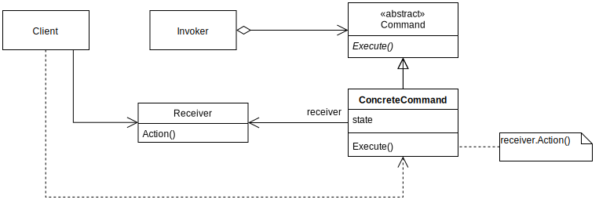
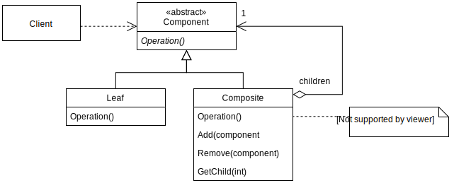
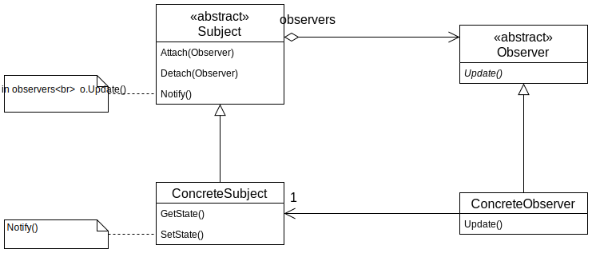
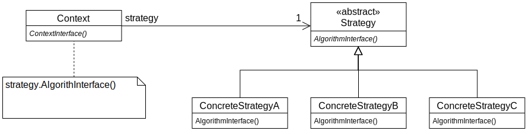

# [Software Design and Testing Laboratory](https://sigarra.up.pt/feup/en/UCURR_GERAL.FICHA_UC_VIEW?pv_ocorrencia_id=560099)

All labs must be submitted via GitHub Classroom. Submitted labs will be assessed as part of the class participation grade.

#### Create repository at GitHub classrooms

- Open the following invite: https://classroom.github.com/a/1QKT-IBv. 
- Search you name or institucional identifier. Accept the assignment.
- Open the github repository generated:
`https://github.com/FEUP-LDTS-2024/lab-w9-design-patterns-<username>`. Leave it open, you will need it later.


## Lab-06: Design Patterns

In software engineering, a software design pattern is a general, reusable solution to a commonly occurring problem within a given context in software design. It is not a finished design that can be transformed directly into source or machine code. Rather, it is a description or template for how to solve a problem that can be used in many different situations. Design patterns are formalized best practices that the programmer can use to solve common problems when designing an application or system.

Object-oriented design patterns typically show relationships and interactions between classes or objects, without specifying the final application classes or objects that are involved. Patterns that imply mutable state may be unsuited for functional programming languages. Some patterns can be rendered unnecessary in languages that have built-in support for solving the problem they are trying to solve, and object-oriented patterns are not necessarily suitable for non-object-oriented languages.

### 1. COMMAND PATTERN

In this exercise we will implement the **Command** pattern.

- Start by creating a new _Gradle/Java_ project in **IntelliJ**.
- Also add **mockito** as a dependency by modifying the **dependencies** section in your `build.grade` file:

```bash
  testImplementation 'org.mockito:mockito-core:3.7.7'
```

- Create a class called `StringDrink` (this will make some sense in a while) that passes the following test:

```java
@Test
public void stringDrink() {
    StringDrink drink = new StringDrink("ABCD");
    assertEquals("ABCD", drink.getText());
    drink.setText("DCBA");
    assertEquals("DCBA", drink.getText());
}
```

- Create an interface named `StringTransformer` declaring the following method:

```java
void execute(StringDrink drink);
```

- Create a class called `StringInverter` that implements the `StringTransformer` interface and passes the following test:

```java
@Test
public void stringInverter() {
    StringDrink drink = new StringDrink("ABCD");
    StringInverter si = new StringInverter();
    si.execute(drink);
    assertEquals("DCBA", drink.getText());
}
```

> :woman_technologist: **Tip**: Strings are immutable. Concatenating strings in order to construct a larger string is inefficient as a lot of strings have to be constructed. The smart way to implement this is to use a [StringBuilder](https://docs.oracle.com/javase/7/docs/api/java/lang/StringBuilder.html). You can also use `StringBuilder`'s `reverse()` method.

- Create a class called `StringCaseChanger` that implements the `StringTransformer` interface and passes the following test:

```java
@Test
public void stringCaseChanger() {
    StringDrink drink = new StringDrink("aBcD");
    StringCaseChanger cc = new StringCaseChanger();
    cc.execute(drink);
    assertEquals("AbCd", drink.getText()); 
}
```

> :woman_technologist: **Tip**: Use the methods [Character.isLowerCase(char)](https://docs.oracle.com/javase/7/docs/api/java/lang/Character.html#isLowerCase(int)), [Character.toUpperCase(char)](https://docs.oracle.com/javase/7/docs/api/java/lang/Character.html#toUpperCase(char)) and [Character.toLowerCase(char)](https://docs.oracle.com/javase/7/docs/api/java/lang/Character.html#toLowerCase(char)).

- Create a class called `StringReplacer` that implements the `StringTransformer` interface and passes the following test:

```java
@Test
public void stringReplacer() {
    StringDrink drink = new StringDrink("ABCDABCD");
    StringReplacer sr = new StringReplacer('A', 'X');
    sr.execute(drink);
    assertEquals("XBCDXBCD", drink.getText());
}
```

> :woman_technologist: **Tip**: Use the method [String.replace(char, char)](https://docs.oracle.com/javase/7/docs/api/java/lang/String.html#replace(char, char)).

- Create a class called `StringRecipe` that receives a list of `StringTransformer`s and passes the following test:

```java
@Test
public void stringRecipe() {
    StringDrink drink = new StringDrink( "AbCd-aBcD");

    StringInverter si = new StringInverter();
    StringCaseChanger cc = new StringCaseChanger();
    StringReplacer sr = new StringReplacer('A', 'X');

    List<StringTransformer> transformers = new ArrayList<>();
    transformers.add(si);
    transformers.add(cc);
    transformers.add(sr);

    StringRecipe recipe = new StringRecipe(transformers);
    recipe.mix(drink);

    assertEquals("dCbX-DcBa", drink.getText());
}
```

You have now implemented the **Command** pattern where the test is the **Client**, the `StringRecipe` is the **Invoker**, the `StringTransfomer` is the command, the three concrete transformers are the **ConcreteCommand**s and the `StringDrink` is the receiver:



> :heavy_exclamation_mark: **Note**: Some benefits of this design:
>
> - `StringRecipe` can apply any of the steps of the recipe (i.e., the > `StringTransformer` implementations) without knowing any detail of how they are actually done.
> - We can reuse the different available `StringTransformer` implementations to define as many recipes as we need.
> - Adding new steps, to use in future recipes, doesn't require us to change any of the possibly already existing recipes or steps.

> :woman_technologist: **Extra**: As an **extra** (at home) exercise, create **undo** actions for each one of the commands so that the following test passes:

```java
@Test
public void transformUndo() {
  StringDrink drink = new StringDrink( "AbCd-aBcD");

  StringInverter si = new StringInverter();
  StringCaseChanger cc = new StringCaseChanger();
  StringReplacer sr = new StringReplacer('A', 'X');

  si.execute(drink);
  cc.execute(drink);
  sr.execute(drink);

  sr.undo(drink);
  assertEquals("dCbA-DcBa", drink.getText());

  cc.undo(drink);
  assertEquals("DcBa-dCbA", drink.getText());

  si.undo(drink);
  assertEquals("AbCd-aBcD", drink.getText());
}
```

### 2. COMPOSITE PATTERN

At this point it’s easy to combine `StringTransformer`s (the steps in our recipes) to assemble different `StringRecipe`s. However, we expect that there will be some particular sequences of steps that appear in many different recipes. How can we reuse these recurring sequences of steps? The Composite pattern will help.

- Create a new class called `StringTransformerGroup` that passes the following test:

```java
@Test
public void transformerGroup() {
  StringDrink drink = new StringDrink( "AbCd-aBcD");

  StringInverter si = new StringInverter();
  StringCaseChanger cc = new StringCaseChanger();

  List<StringTransformer> transformers = new ArrayList<>();
  transformers.add(si);
  transformers.add(cc);

  StringTransformerGroup tg = new StringTransformerGroup(transformers);
  tg.execute(drink);

  assertEquals("dCbA-DcBa", drink.getText());
}
```

- As you can see, a `StringTransformerGroup` is very similar to the `StringRecipe` class. The main difference is that we will make the `TransformerGroup` also implement the `StringTransformer` interface. This should make the following test pass:

```java
@Test
public void transformerComposite() {
    StringDrink drink = new StringDrink("AbCd-aBcD");

    StringInverter si = new StringInverter();
    StringCaseChanger cc = new StringCaseChanger();
    StringReplacer sr = new StringReplacer('A', 'X');

    List<StringTransformer> transformers1 = new ArrayList<>();
    transformers1.add(si);
    transformers1.add(cc);
    StringTransformerGroup tg1 = new StringTransformerGroup(transformers1);

    List<StringTransformer> transformers2 = new ArrayList<>();
    transformers2.add(sr);
    transformers2.add(cc);
    StringTransformerGroup tg2 = new StringTransformerGroup(transformers2);

    List<StringTransformer> transformers3 = new ArrayList<>();
    transformers3.add(tg1);
    transformers3.add(tg2);

    StringRecipe recipe = new StringRecipe(transformers3);
    recipe.mix(drink);

    assertEquals("DcBx-dCbA", drink.getText());
}
```

You have now implemented the **Composite** pattern where the `StringTransformer` is the **Component**, and the `TransformerGroup` is the **Composite**:



> :heavy_exclamation_mark: **Note**: Some benefits of this design:
>
> - We are able to represent part-whole hierarchies.
> - When assembling `StringRecipe`s, we can use and combine irrespectively of their differences individual steps (of classes `StringCaseChanger`, `StringInverter` or `StringReplacer`) and sequences of steps (`TransformerGroup`).

### 3. OBSERVER PATTERN

We will now implement a bar where clients will be able to order drinks by specifying their recipes. However, our clients want to be notified every time their favorite bars go into happy hour. We can use the observer pattern for this.

- Create a new *abstract* class named `Bar` having the following methods:

```java
  abstract public boolean isHappyHour();
  abstract public void startHappyHour(); 
  abstract public void endHappyHour();
```

- Create a new class called `StringBar` that extends the `Bar` class.
- And write the code for each of the methods so that the following tests pass:

```java
@Test
public void happyHour() {
  Bar bar = new StringBar();
  assertFalse(bar.isHappyHour());

  bar.startHappyHour();
  assertTrue(bar.isHappyHour());

  bar.endHappyHour();
  assertFalse(bar.isHappyHour());
}
```

- Create a new interface called `BarObserver` declaring the following methods:

```java
void happyHourStarted(Bar bar);
void happyHourEnded(Bar bar);
```

- Also, add the following methods to the `Bar` class and modify the constructor so that the observers `List` is initialized properly:

```java
public void addObserver(BarObserver observer) {
  observers.add(observer);
}

public void removeObserver(BarObserver observer) {
  observers.remove(observer);
}

public void notifyObservers() {
  for (BarObserver observer : observers)
    if (isHappyHour()) observer.happyHourStarted(this);
    else observer.happyHourEnded(this);
}
```

- Make sure the `Bar` class is calling the `notifyObservers` method when appropriate.
- Create a new interface called `Client` that extends the `BarObserver` and declares the following method:

```java
void wants(StringDrink drink, StringRecipe recipe, StringBar bar);
```

- Create a new class called `HumanClient` (reasons for this will be apparent latter on) that implements the `Client` interface and passes the following tests (note how we are using **mockito** and a **Mock** to verify if the observer methods are being called; you can do the same using Spock):

```java
@Test
public void addObserver() {
  Bar bar = new StringBar();

  HumanClient clientMock = Mockito.mock(HumanClient.class);
  bar.addObserver(clientMock);

  Mockito.verify(clientMock, Mockito.never()).happyHourStarted(bar);
  Mockito.verify(clientMock, Mockito.never()).happyHourEnded(bar);

  bar.startHappyHour();
  Mockito.verify(clientMock, Mockito.times(1)).happyHourStarted(bar);
  Mockito.verify(clientMock, Mockito.never()).happyHourEnded(bar);

  bar.endHappyHour();
  Mockito.verify(clientMock, Mockito.times(1)).happyHourStarted(bar);
  Mockito.verify(clientMock, Mockito.times(1)).happyHourEnded(bar);
}

@Test
public void removeObserver() {
  Bar bar = new StringBar();

  HumanClient clientMock = Mockito.mock(HumanClient.class);
  bar.addObserver(clientMock);
  bar.removeObserver(clientMock);

  bar.startHappyHour();
  bar.endHappyHour();

  Mockito.verify(clientMock, Mockito.never()).happyHourStarted(bar);
  Mockito.verify(clientMock, Mockito.never()).happyHourEnded(bar);
}
```

You have now implemented the **Observer** pattern where the `BarObserver` is the **Observer**, the `HumanClient` is the **ConcreteObserver**, the `Bar` is the **Subject**, and the `StringBar` is the **ConcreteSubject**:



> :heavy_exclamation_mark: **Note**: Benefit of this design:
> 
> - The `Bar` class doesn't know anything about the `Client` class. It knows of `BarObserver`s and that it needs to notify them when it goes in and out of happy hour, but knows nothing of what these `BarObserver`s do (and how they do it) when it notifies them.

### 4. STRATEGY PATTERN

Our clients may want to adopt different approaches to their drink ordering. We can use the strategy pattern for this!

- Add a new method (`order`) to the `StringBar` class, so that clients can order their favorite `StringRecipe`s, that passes the following test (as you can see we are using a method to facilitate creating a recipe):

```java
private StringRecipe getRecipe() {
    StringInverter si = new StringInverter();
    StringCaseChanger cc = new StringCaseChanger();
    StringReplacer sr = new StringReplacer('A', 'X');

    List<StringTransformer> transformers = new ArrayList<>();
    transformers.add(si);
    transformers.add(cc);
    transformers.add(sr);

    StringRecipe recipe = new StringRecipe(transformers);
    return recipe;
}

@Test
public void orderStringRecipe() {
    StringBar stringBar = new StringBar();
    StringDrink drink = new StringDrink("AbCd-aBcD");
    StringRecipe recipe = getRecipe();

    stringBar.order(drink, recipe);
    assertEquals("dCbX-DcBa", drink.getText());
}
```

- Now, create a new interface called `OrderingStrategy` declaring the following methods:

```java
void wants(StringDrink drink, StringRecipe recipe, StringBar bar);
void happyHourStarted(StringBar bar);
void happyHourEnded(StringBar bar);
```

- Now lets create two new classes implementing the `OrderingStrategy` interface. One that orders drinks **immediately** after we want them, and one that **waits** for the happy hour to start (saving wanted drinks in a list). Lets call them `ImpatientStrategy` and `SmartStrategy`.
- Using **dependency injection** to inject a `OrderingStrategy` into a `HumanClient`, make the following tests pass:

```java
@Test
public void impatientStrategy() {
    StringBar stringBar = new StringBar();
    StringDrink drink = new StringDrink("AbCd-aBcD");
    StringRecipe recipe = getRecipe();

    ImpatientStrategy strategy = new ImpatientStrategy();
    HumanClient client = new HumanClient(strategy);

    // Recipe is ordered immediately
    client.wants(drink, recipe, stringBar);
    assertEquals("dCbX-DcBa", drink.getText());
}

@Test
public void smartStrategyStartOpened() {
    StringBar stringBar = new StringBar();
    StringDrink drink = new StringDrink("AbCd-aBcD");
    StringRecipe recipe = getRecipe();

    SmartStrategy strategy = new SmartStrategy();
    HumanClient client = new HumanClient(strategy);

    // Recipe is ordered immediately as happy hour was already under way
    stringBar.startHappyHour();
    client.wants(drink, recipe, stringBar);
    assertEquals("dCbX-DcBa", drink.getText());
}

@Test
public void smartStrategyStartClosed() {
    StringBar stringBar = new StringBar();
    StringDrink drink = new StringDrink("AbCd-aBcD");
    StringRecipe recipe = getRecipe();

    SmartStrategy strategy = new SmartStrategy();
    HumanClient client = new HumanClient(strategy);
    stringBar.addObserver(client); // this is important!

    client.wants(drink, recipe, stringBar);
    assertEquals("AbCd-aBcD", drink.getText());

    // Recipe is only ordered here
    stringBar.startHappyHour();
    assertEquals("dCbX-DcBa", drink.getText());
}
```

You have now implemented the **Strategy** pattern where the `OrderingStrategy` is the **Strategy**, the `ImpatientStrategy` and `SmartStrategy` are the **ConcreteStrategies**, and the **Context** is the `HumanClient`:



> :heavy_exclamation_mark: **Note**: Some benefits of this design:
>
> - We can configure our `HumanClient` class with different ordering behaviors.
> - The `HumanClient` doesn't need to know anything about the process of ordering or the data that it uses, it simply delegates this to the implementation of the `OrderingStrategy` class that is in use.
> - Conditional logic is avoided by encapsulating each behavior in a different class and using polymorphism.

### 5. FACTORY-METHOD PATTERN

Humans are complicated! Fortunately, aliens are much simpler. There are only two different alien races known to frequent `StringBar`s: the **Ferengi**  and the **Romulans**.

Contrary to humans, that are configured with a different `OrderingStrategy` when they are born, all **Ferengi**  use the `SmartStrategy`, while all **Romulans** use the `ImpatientStrategy`.

- Create an abstract `AlienClient` class like this one:

```java
public abstract class AlienClient implements Client {
  private OrderingStrategy strategy;

  public AlienClient() {
      this.strategy = createOrderingStrategy();
  }

  @Override
  public void happyHourStarted(Bar bar) {
      strategy.happyHourStarted((StringBar) bar);
  }

  @Override
  public void happyHourEnded(Bar bar) {
      strategy.happyHourEnded((StringBar) bar);
  }

  @Override
  public void wants(StringDrink drink, StringRecipe recipe, StringBar bar) {
      strategy.wants(drink, recipe, bar);
  }

  protected abstract  OrderingStrategy createOrderingStrategy();
}
```

- Note how we are leaving the decision to create an `OrderingStrategy` to the subclasses of this class by not providing an implementation for the `createOrderingStrategy` method.
- Now, create two subclasses of this class (for the **Ferengi** and **Romulan** alien races) so that the following tests pass:

```java
@Test
public void ferengiAlreadyOpened() {
    StringBar stringBar = new StringBar();
    StringDrink drink = new StringDrink("AbCd-aBcD");
    StringRecipe recipe = getRecipe();

    FerengiClient client = new FerengiClient();

    // Recipe is ordered immediately
    stringBar.startHappyHour();
    client.wants(drink, recipe, stringBar);
    assertEquals("dCbX-DcBa", drink.getText());
}

@Test
public void ferengiStartClosed() {
    StringBar stringBar = new StringBar();
    StringDrink drink = new StringDrink("AbCd-aBcD");
    StringRecipe recipe = getRecipe();

    FerengiClient client = new FerengiClient();
    stringBar.addObserver(client); // this is important!

    client.wants(drink, recipe, stringBar);
    assertEquals("AbCd-aBcD", drink.getText());

    // Recipe is only ordered here
    stringBar.startHappyHour();
    assertEquals("dCbX-DcBa", drink.getText());
}

@Test
public void romulan() {
    StringBar stringBar = new StringBar();
    StringDrink drink = new StringDrink("AbCd-aBcD");
    StringRecipe recipe = getRecipe();

    RomulanClient client = new RomulanClient();

    // Recipe is ordered immediately
    client.wants(drink, recipe, stringBar);
    assertEquals("dCbX-DcBa", drink.getText());
}
```

You have now implemented the **Factory-Method** pattern where the `AlienClient` is the **Creator**, the two different alien races are the `ConcreteCreator`s, the `OrderingStrategy` is the **Product** and the two different strategies are the **ConcreteProducts**:


> :heavy_exclamation_mark: **Note**: Some benefits of this design:
>
> - The `AlienClient` doesn't need to anticipate what is the implementation of `OrderingStrategy` that it must create.
> - This responsibility is delegated to the several subclasses, so to change the ordering strategy that is created we only need to change one class.